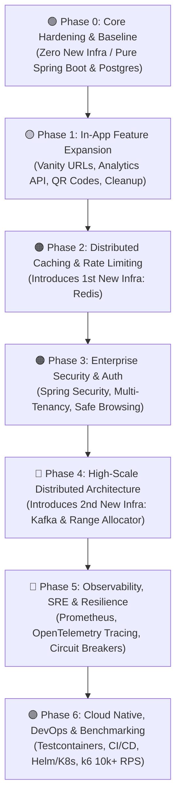

# 🗺️ Project Roadmap & Issue Templates

This document contains all 26 user stories and 7 epics mapped **field-for-field** to the GitHub Issue Forms (`.github/ISSUE_TEMPLATE/`).

---

## 📌 Phased Progression Overview



---

# 🟢 Phase 0: Core Hardening & Baseline Completion

---

### Epic 0: Phase 0 Epic
* **Template:** `🎯 Epic / Architectural Pillar`
* **Title:** `[EPIC] Phase 0: Core Hardening & Baseline Completion`

**🎯 Epic Vision & Goal:**
```text
Complete foundational application layer gaps (RFC 7807 error handling, SSRF defense, configurable URLs, expiration TTL, and async click telemetry) before introducing distributed infrastructure.
```

**📋 Tracked Stories & Sub-Issues:**
```text
- [ ] #1 [Core] Implement Global Exception Handler with RFC 7807 ProblemDetail
- [ ] #2 [Security/Core] Add strict URL validation, protocol whitelisting, and SSRF prevention
- [ ] #3 [Config] Decouple hardcoded localhost URL from controller to configuration properties
- [ ] #4 [Feature] Support optional expiration timestamp and enforce TTL on redirect
- [ ] #5 [Analytics] Implement ClickEvent entity, repository, and async telemetry recorder
```

**📊 Success Metrics & Definition of Done:**
```text
- [ ] All 5 child stories merged to main
- [ ] Unit and MockMvc tests passing
- [ ] Zero unhandled 500 errors on invalid inputs
- [ ] Clicks recorded asynchronously without redirect slowdown
```

---

### Story 0.1: Global Exception Handling & ProblemDetails
* **Template:** `✨ Feature Request / Story`
* **Title:** `[Core] Implement Global Exception Handler with RFC 7807 ProblemDetail`
* **Layer:** `layer:api (Controller, DTO, REST)`
* **Priority:** `priority:high`

**📖 Context & Problem Statement:**
```text
Currently, UrlShortenerService throws raw IllegalArgumentException when a short code is not found, resulting in an unhandled 500 error. We need clean, structured RFC 7807 error responses for API consumers.
```

**🛠️ Proposed Solution & Technical Tasks:**
```text
- [ ] Create @RestControllerAdvice class GlobalExceptionHandler
- [ ] Implement custom domain exceptions (UrlNotFoundException, InvalidUrlException, UrlExpiredException)
- [ ] Map exceptions to RFC 7807 ProblemDetail (404, 400, 410, 500)
- [ ] Handle MethodArgumentNotValidException to return field-level validation errors
- [ ] Add unit and MockMvc tests for exception responses
```

**✅ Acceptance Criteria:**
```text
- [ ] Requesting a non-existent short code returns HTTP 404 with RFC 7807 JSON.
- [ ] Malformed payloads return HTTP 400 with a list of invalid fields.
- [ ] Internal errors do not leak stack traces or schema details to clients.
```

---

### Story 0.2: Request Validation & URL Sanitization
* **Template:** `✨ Feature Request / Story`
* **Title:** `[Security/Core] Add strict URL validation, protocol whitelisting, and SSRF prevention`
* **Layer:** `layer:core (Service, Domain Logic, Security)`
* **Priority:** `priority:high`

**📖 Context & Problem Statement:**
```text
ShortenRequest currently accepts any arbitrary string without format or scheme verification, leaving the system vulnerable to SSRF (Server-Side Request Forgery) and invalid redirect targets.
```

**🛠️ Proposed Solution & Technical Tasks:**
```text
- [ ] Add jakarta.validation constraints to ShortenRequest
- [ ] Implement custom @ValidUrl validator checking protocol whitelist (http://, https:// only)
- [ ] Block loopback and private IP addresses (127.0.0.1, localhost, 10.0.0.0/8, 192.168.0.0/16)
- [ ] Enforce maximum URL character length (2048 characters)
- [ ] Annotate UrlController endpoint with @Valid
```

**✅ Acceptance Criteria:**
```text
- [ ] URLs with invalid schemes (e.g. javascript:, file:) are rejected with HTTP 400.
- [ ] Localhost and private network targets are blocked to prevent SSRF.
- [ ] Valid URLs (https://example.com) are accepted and shortened.
```

---

### Story 0.3: Dynamic Base URL Configuration
* **Template:** `✨ Feature Request / Story`
* **Title:** `[Config] Decouple hardcoded localhost URL from controller to configuration properties`
* **Layer:** `layer:api (Controller, DTO, REST)`
* **Priority:** `priority:medium`

**📖 Context & Problem Statement:**
```text
UrlController currently hardcodes "http://localhost:9090/" + url.getShortCode(), preventing deployment to custom domains, staging, or production environments.
```

**🛠️ Proposed Solution & Technical Tasks:**
```text
- [ ] Create @ConfigurationProperties(prefix = "app.shortener") class with baseUrl property
- [ ] Support environment variable override via APP_SHORTENER_BASE_URL
- [ ] Update UrlController to assemble short URLs using configured base URL
- [ ] Sanitize and normalize trailing slashes
```

**✅ Acceptance Criteria:**
```text
- [ ] Short URL response reflects the configured domain.
- [ ] Setting APP_SHORTENER_BASE_URL=https://sho.rt produces https://sho.rt/{shortCode}.
```

---

### Story 0.4: URL Expiration & TTL Enforcement
* **Template:** `✨ Feature Request / Story`
* **Title:** `[Feature] Support optional expiration timestamp and enforce TTL on redirect`
* **Layer:** `layer:core (Service, Domain Logic, Security)`
* **Priority:** `priority:high`

**📖 Context & Problem Statement:**
```text
The Flyway schema already contains the expires_at column in the urls table, but the application layer does not populate or verify it during redirect lookups.
```

**🛠️ Proposed Solution & Technical Tasks:**
```text
- [ ] Extend ShortenRequest with optional expiresInSeconds or expiresAt field
- [ ] Persist expires_at timestamp in UrlShortenerService.shortenUrl()
- [ ] Check expiration timestamp in getOriginalUrl() and throw UrlExpiredException if expired
- [ ] Map UrlExpiredException to HTTP 410 (Gone) in GlobalExceptionHandler
- [ ] Evict expired links from cache
```

**✅ Acceptance Criteria:**
```text
- [ ] Active short link redirects with HTTP 302 before expiration.
- [ ] Expired short link returns HTTP 410 Gone and does not redirect.
```

---

### Story 0.5: Click Telemetry Ingestion Baseline
* **Template:** `✨ Feature Request / Story`
* **Title:** `[Analytics] Implement ClickEvent entity, repository, and async telemetry recorder`
* **Layer:** `layer:data (Repository, JPA, Cache, DB Migration)`
* **Priority:** `priority:high`

**📖 Context & Problem Statement:**
```text
The click_events table exists in Flyway V1, but there is no Java entity or service writing telemetry. We need non-blocking asynchronous click event capture.
```

**🛠️ Proposed Solution & Technical Tasks:**
```text
- [ ] Create ClickEvent JPA entity mapped to click_events table
- [ ] Create ClickEventRepository with Spring Data JPA
- [ ] Create AnalyticsService with Spring @Async method to persist click records
- [ ] Hash client IP using SHA-256 for GDPR compliance
- [ ] Capture User-Agent, Referer, and hashed IP during redirect in UrlController
```

**✅ Acceptance Criteria:**
```text
- [ ] Each redirect inserts a record into click_events with hashed IP, user agent, referer, and timestamp.
- [ ] Click logging execution does not increase HTTP 302 redirect latency.
```

---

# 🟡 Phase 1: In-App Feature Expansion

---

### Epic 1: Phase 1 Epic
* **Template:** `🎯 Epic / Architectural Pillar`
* **Title:** `[EPIC] Phase 1: In-App Feature Expansion`

**🎯 Epic Vision & Goal:**
```text
Deliver key user capabilities (custom vanity aliases, rich analytics aggregation, QR code rendering, and scheduled cleanup) entirely within the existing application and PostgreSQL stack.
```

**📋 Tracked Stories & Sub-Issues:**
```text
- [ ] #6 [Feature] Support Custom Short Codes with Reserved Keyword Blacklist
- [ ] #7 [Analytics] Real-Time Analytics API (Time-Series, Referrers, Devices)
- [ ] #8 [Data] Scheduled Background Job for Expired URL Pruning
- [ ] #9 [Feature] Dynamic PNG/SVG QR Code Generation Endpoint
```

**📊 Success Metrics & Definition of Done:**
```text
- [ ] Custom vanity aliases supported with collision and reserved keyword handling
- [ ] Analytics endpoint returns aggregated metrics efficiently
- [ ] Scheduled cleanup purges expired records in non-blocking batches
- [ ] Dynamic QR codes generated with sub-5ms response
```

---

### Story 1.1: Custom Vanity Aliases & Keyword Reservation
* **Template:** `✨ Feature Request / Story`
* **Title:** `[Feature] Support Custom Short Codes with Reserved Keyword Blacklist`
* **Layer:** `layer:core (Service, Domain Logic, Security)`
* **Priority:** `priority:medium`

**📖 Context & Problem Statement:**
```text
Users need branded, readable short links (e.g. /summer-sale-2026) instead of only auto-generated Base62 codes.
```

**🛠️ Proposed Solution & Technical Tasks:**
```text
- [ ] Add optional customAlias field to ShortenRequest
- [ ] Add validation regex pattern: ^[a-zA-Z0-9_-]{3,30}$
- [ ] Enforce reserved keyword blacklist (api, actuator, swagger, health, metrics, admin)
- [ ] Update UrlShortenerService to save custom alias and handle unique constraint collisions
- [ ] Return 409 Conflict if alias is already taken
```

**✅ Acceptance Criteria:**
```text
- [ ] Shortening with an available custom alias returns HTTP 201 with that code.
- [ ] Shortening with an existing alias returns HTTP 409 Conflict.
- [ ] Attempting to claim reserved keywords returns HTTP 400 Bad Request.
```

---

### Story 1.2: Aggregated Click Analytics API Engine
* **Template:** `✨ Feature Request / Story`
* **Title:** `[Analytics] Real-Time Analytics API (Time-Series, Referrers, Devices)`
* **Layer:** `layer:api (Controller, DTO, REST)`
* **Priority:** `priority:high`

**📖 Context & Problem Statement:**
```text
Users who create short links need visibility into link performance, visitor trends, and audience demographics.
```

**🛠️ Proposed Solution & Technical Tasks:**
```text
- [ ] Define AnalyticsResponse DTO (total clicks, unique visitors, time-series, referrers, devices)
- [ ] Write optimized aggregation queries in ClickEventRepository
- [ ] Create endpoint GET /api/v1/urls/{shortCode}/analytics
- [ ] Return 404 Not Found if short code does not exist
```

**✅ Acceptance Criteria:**
```text
- [ ] Calling GET /api/v1/urls/{shortCode}/analytics returns structured JSON with accurate metrics.
- [ ] Queries perform efficiently using idx_click_events_analytics index.
```

---

### Story 1.3: Scheduled Expiration Cleanup Job
* **Template:** `✨ Feature Request / Story`
* **Title:** `[Data] Scheduled Background Job for Expired URL Pruning`
* **Layer:** `layer:data (Repository, JPA, Cache, DB Migration)`
* **Priority:** `priority:medium`

**📖 Context & Problem Statement:**
```text
Over time, expired URLs accumulate in PostgreSQL, increasing table sizes and degrading index performance.
```

**🛠️ Proposed Solution & Technical Tasks:**
```text
- [ ] Enable Spring scheduling with @EnableScheduling
- [ ] Implement UrlCleanupScheduler running on configurable cron schedule (e.g. daily at 2:00 AM)
- [ ] Delete expired records in non-blocking batches of 1,000 rows
- [ ] Evict deleted short codes from cache
```

**✅ Acceptance Criteria:**
```text
- [ ] Scheduled job runs automatically and purges records where expires_at < NOW().
- [ ] Deletions occur in bounded batches without blocking live read/write traffic.
```

---

### Story 1.4: Dynamic QR Code Generation
* **Template:** `✨ Feature Request / Story`
* **Title:** `[Feature] Dynamic PNG/SVG QR Code Generation Endpoint`
* **Layer:** `layer:api (Controller, DTO, REST)`
* **Priority:** `priority:low`

**📖 Context & Problem Statement:**
```text
Users sharing links on print media, presentations, and mobile applications require instant QR code graphics.
```

**🛠️ Proposed Solution & Technical Tasks:**
```text
- [ ] Add ZXing (com.google.zxing:core, com.google.zxing:javase) dependencies
- [ ] Create QrCodeService to render PNG byte arrays from text
- [ ] Implement endpoint GET /{shortCode}/qr with optional size query param (default: 250px)
- [ ] Set response Content-Type: image/png with Cache-Control headers
```

**✅ Acceptance Criteria:**
```text
- [ ] GET /{shortCode}/qr returns a valid PNG image rendering the full redirect URL.
- [ ] Scanning QR code on a mobile device opens the short link.
```

---

# 🟠 Phase 2: Distributed Caching & Rate Limiting

---

### Epic 2: Phase 2 Epic
* **Template:** `🎯 Epic / Architectural Pillar`
* **Title:** `[EPIC] Phase 2: Distributed Caching & Rate Limiting`

**🎯 Epic Vision & Goal:**
```text
Introduce Redis infrastructure to support horizontal scaling, eliminate multi-instance cache drift, and protect public APIs with distributed sliding-window rate limiting.
```

**📋 Tracked Stories & Sub-Issues:**
```text
- [ ] #10 [Performance] Implement Two-Tier Caching (L1 Caffeine + L2 Redis)
- [ ] #11 [Security] Implement distributed sliding-window rate limiting via Redis
```

**📊 Success Metrics & Definition of Done:**
```text
- [ ] Redis operational in docker-compose and Spring Boot
- [ ] Two-tier caching eliminates database reads across replicas on repeated redirects
- [ ] Rate limiter throttles traffic above threshold with HTTP 429
```

---

### Story 2.1: Two-Tier Distributed Caching (L1 Caffeine + L2 Redis)
* **Template:** `✨ Feature Request / Story`
* **Title:** `[Performance] Implement Two-Tier Caching (L1 Caffeine + L2 Redis)`
* **Layer:** `layer:data (Repository, JPA, Cache, DB Migration)`
* **Priority:** `priority:critical`

**📖 Context & Problem Statement:**
```text
Currently, Caffeine is purely in-memory on a single JVM. Multiple replicas behind a load balancer suffer cache incoherency and database read spikes on cache misses.
```

**🛠️ Proposed Solution & Technical Tasks:**
```text
- [ ] Add spring-boot-starter-data-redis and Redis service to docker-compose.yml
- [ ] Configure Redis CacheManager with default TTL (24 hours)
- [ ] Implement L1 Caffeine near-cache with L2 Redis fallback
- [ ] Implement Redis Pub/Sub invalidation topic to clear L1 caches across all active app nodes on URL updates/deletions
```

**✅ Acceptance Criteria:**
```text
- [ ] Cache hits on any cluster instance resolve from Redis/Caffeine without database queries.
- [ ] Key eviction on Node A publishes invalidation message clearing Node B's local L1 cache.
```

---

### Story 2.2: Distributed Sliding-Window Rate Limiting
* **Template:** `✨ Feature Request / Story`
* **Title:** `[Security] Implement distributed sliding-window rate limiting via Redis`
* **Layer:** `layer:infra (Docker, Kafka, Redis, CI/CD)`
* **Priority:** `priority:critical`

**📖 Context & Problem Statement:**
```text
Without rate limiting, malicious clients can overwhelm redirect lookups or exhaust database sequences by spamming URL generation.
```

**🛠️ Proposed Solution & Technical Tasks:**
```text
- [ ] Implement Redis sliding-window token bucket using Bucket4j or atomic Lua script
- [ ] Create RateLimitingFilter with tiered policies:
  - Redirect: 100 requests / second per IP
  - Shorten: 10 requests / minute per IP
- [ ] Include standard headers: X-RateLimit-Limit, X-RateLimit-Remaining, Retry-After
- [ ] Return 429 Too Many Requests when limit is exceeded
```

**✅ Acceptance Criteria:**
```text
- [ ] Requests exceeding threshold are rejected with HTTP 429 before reaching controllers.
- [ ] Rate limits work consistently across multiple application replicas sharing Redis.
```

---

# 🟠 Phase 3: Enterprise Security & Access Control

---

### Epic 3: Phase 3 Epic
* **Template:** `🎯 Epic / Architectural Pillar`
* **Title:** `[EPIC] Phase 3: Enterprise Security & Access Control`

**🎯 Epic Vision & Goal:**
```text
Secure management endpoints with multi-tenant API key authentication, block malicious URLs via threat feed integration, and isolate management Actuator endpoints.
```

**📋 Tracked Stories & Sub-Issues:**
```text
- [ ] #12 [Security] Multi-Tenant API Key Authentication with Spring Security
- [ ] #13 [Security] Phishing & Malicious URL detection via Google Safe Browsing API
- [ ] #14 [Security] Enforce OWASP security headers, CORS policies, and separate Actuator port
```

**📊 Success Metrics & Definition of Done:**
```text
- [ ] Management and analytics APIs require valid API keys
- [ ] Malicious destination URLs rejected with HTTP 422
- [ ] Actuator endpoints inaccessible from public traffic
```

---

### Story 3.1: Multi-Tenant API Key Authentication
* **Template:** `✨ Feature Request / Story`
* **Title:** `[Security] Multi-Tenant API Key Authentication with Spring Security`
* **Layer:** `layer:core (Service, Domain Logic, Security)`
* **Priority:** `priority:high`

**📖 Context & Problem Statement:**
```text
Enterprise usage requires identifying clients, tracking quotas per tenant, and preventing unauthorized access to link management and analytics data.
```

**🛠️ Proposed Solution & Technical Tasks:**
```text
- [ ] Add spring-boot-starter-security dependency
- [ ] Create api_keys table (tenant_id, key_hash, tier, is_active, created_at)
- [ ] Implement ApiKeyAuthenticationFilter extracting and verifying X-API-Key header with SHA-256
- [ ] Associate URLs and analytics queries with authenticated tenant_id
- [ ] Keep public redirect GET /{shortCode} unauthenticated
```

**✅ Acceptance Criteria:**
```text
- [ ] Management requests with valid X-API-Key authenticate successfully.
- [ ] Missing or invalid API keys return HTTP 401 Unauthorized.
- [ ] Tenants can only access analytics for URLs created under their tenant_id.
```

---

### Story 3.2: Malicious URL & Phishing Scanner
* **Template:** `✨ Feature Request / Story`
* **Title:** `[Security] Phishing & Malicious URL detection via Google Safe Browsing API`
* **Layer:** `layer:core (Service, Domain Logic, Security)`
* **Priority:** `priority:medium`

**📖 Context & Problem Statement:**
```text
URL shorteners are frequent targets for spammers hiding malicious destination URLs, malware downloads, and phishing pages.
```

**🛠️ Proposed Solution & Technical Tasks:**
```text
- [ ] Create SafeBrowsingClient with configurable API key and timeout
- [ ] Check destination URLs against Google Safe Browsing Lookup API before shortening
- [ ] Add circuit breaker to ensure external API downtime fails open gracefully
- [ ] Reject detected malware/phishing links with HTTP 422 Unprocessable Entity
```

**✅ Acceptance Criteria:**
```text
- [ ] Submitting known malware/phishing test URLs is blocked with HTTP 422.
- [ ] Safe URLs proceed normally through creation.
```

---

### Story 3.3: OWASP Security Hardening & Actuator Isolation
* **Template:** `✨ Feature Request / Story`
* **Title:** `[Security] Enforce OWASP security headers, CORS policies, and separate Actuator port`
* **Layer:** `layer:core (Service, Domain Logic, Security)`
* **Priority:** `priority:medium`

**📖 Context & Problem Statement:**
```text
Sensitive Spring Boot Actuator endpoints (/actuator/env, /actuator/beans) must never be accessible to public Internet traffic.
```

**🛠️ Proposed Solution & Technical Tasks:**
```text
- [ ] Configure OWASP security headers in SecurityFilterChain (X-Content-Type-Options, X-Frame-Options: DENY, CSP)
- [ ] Configure explicit CORS origins whitelist for management APIs
- [ ] Move management port to 9091 (management.server.port=9091) in application.yaml
```

**✅ Acceptance Criteria:**
```text
- [ ] Public traffic on port 9090 cannot reach /actuator endpoints.
- [ ] All HTTP responses contain standard OWASP security headers.
```

---

# 🔴 Phase 4: High-Scale Distributed Architecture

---

### Epic 4: Phase 4 Epic
* **Template:** `🎯 Epic / Architectural Pillar`
* **Title:** `[EPIC] Phase 4: High-Scale Distributed Architecture`

**🎯 Epic Vision & Goal:**
```text
Eliminate database write bottlenecks by introducing a distributed Range-Based ID Allocator and decoupling click event writes into a Kafka event streaming pipeline.
```

**📋 Tracked Stories & Sub-Issues:**
```text
- [ ] #15 [Architecture] Replace single PostgreSQL sequence with distributed Range-Based ID Allocator
- [ ] #16 [Architecture] Decouple Click Telemetry via Message Broker (Kafka / RabbitMQ)
- [ ] #17 [Data] Partition Click Events Table by Range / Time
```

**📊 Success Metrics & Definition of Done:**
```text
- [ ] 100x reduction in database sequence queries during URL shortening
- [ ] Ingest 20,000+ clicks/sec via Kafka without database lock contention
- [ ] Database partitioning maintains sub-10ms query execution across 10M+ records
```

---

### Story 4.1: Distributed Range-Based ID Allocator
* **Template:** `✨ Feature Request / Story`
* **Title:** `[Architecture] Replace single PostgreSQL sequence with distributed Range-Based ID Allocator`
* **Layer:** `layer:core (Service, Domain Logic, Security)`
* **Priority:** `priority:critical`

**📖 Context & Problem Statement:**
```text
Currently, each shortenUrl() query calls nextval('url_id_seq') directly on PostgreSQL, creating a single-point write bottleneck under high concurrent load.
```

**🛠️ Proposed Solution & Technical Tasks:**
```text
- [ ] Create id_ranges table in PostgreSQL / Redis token coordinator
- [ ] Implement RangeIdAllocatorService leasing blocks of IDs (10,000 IDs per lease)
- [ ] Dispense IDs in memory with AtomicLong without database roundtrips
- [ ] Asynchronously pre-fetch next range when current range is 80% exhausted
- [ ] Handle node crash and restart cleanly without ID collisions
```

**✅ Acceptance Criteria:**
```text
- [ ] Application nodes dispense unique Base62 IDs locally.
- [ ] Under a load of 10,000 creations, PostgreSQL is contacted only once for ID leasing.
```

---

### Story 4.2: Asynchronous Click Telemetry via Kafka / RabbitMQ
* **Template:** `✨ Feature Request / Story`
* **Title:** `[Architecture] Decouple Click Telemetry via Message Broker (Kafka / RabbitMQ)`
* **Layer:** `layer:infra (Docker, Kafka, Redis, CI/CD)`
* **Priority:** `priority:high`

**📖 Context & Problem Statement:**
```text
In-memory @Async thread pools drop telemetry events during application restarts or database connection pool exhaustion.
```

**🛠️ Proposed Solution & Technical Tasks:**
```text
- [ ] Add spring-kafka dependency and Kafka broker to docker-compose.yml
- [ ] Publish click events to url-clicks topic upon redirect
- [ ] Create batch consumer worker pool consuming events in batches of 500 and performing bulk inserts (saveAll) into PostgreSQL
- [ ] Implement Dead-Letter Topic (DLQ) for corrupted events
```

**✅ Acceptance Criteria:**
```text
- [ ] Click events are safely published to Kafka topic in < 2ms.
- [ ] Batch consumer flushes records into PostgreSQL efficiently.
- [ ] Service restarts during high traffic cause zero dropped telemetry events.
```

---

### Story 4.3: Database Partitioning for Analytics Tables
* **Template:** `✨ Feature Request / Story`
* **Title:** `[Data] Partition Click Events Table by Range / Time`
* **Layer:** `layer:data (Repository, JPA, Cache, DB Migration)`
* **Priority:** `priority:medium`

**📖 Context & Problem Statement:**
```text
Unpartitioned append-only analytics tables cause sequential scan degradation, bloated indexes, and expensive maintenance operations as data grows.
```

**🛠️ Proposed Solution & Technical Tasks:**
```text
- [ ] Write Flyway migration V2__partition_click_events.sql converting click_events to range-partitioned table (PARTITION BY RANGE (clicked_at))
- [ ] Create monthly partition tables for current and future months
- [ ] Verify query execution plans utilize partition pruning
```

**✅ Acceptance Criteria:**
```text
- [ ] click_events inserts and queries route automatically to the appropriate monthly partition.
- [ ] Old partitions can be dropped instantly with DROP TABLE without full table locks.
```

---

# 🔴 Phase 5: Production Observability, SRE & Resilience

---

### Epic 5: Phase 5 Epic
* **Template:** `🎯 Epic / Architectural Pillar`
* **Title:** `[EPIC] Phase 5: Production Observability, SRE & Resilience`

**🎯 Epic Vision & Goal:**
```text
Achieve production observability with Prometheus metrics, OpenTelemetry distributed tracing, structured JSON logging, and Resilience4j circuit breakers for high availability.
```

**📋 Tracked Stories & Sub-Issues:**
```text
- [ ] #18 [Observability] Instrument Custom Business & System Metrics with Micrometer
- [ ] #19 [Observability] Add OpenTelemetry Distributed Tracing & W3C TraceContext propagation
- [ ] #20 [Observability] Configure Logback JSON Layout with MDC Trace Correlation
- [ ] #21 [SRE] Resilience4j Circuit Breakers and Fallbacks for Redis, Kafka, and Database
```

**📊 Success Metrics & Definition of Done:**
```text
- [ ] Prometheus scrapes custom latency percentiles (p50, p95, p99) and cache ratios
- [ ] Distributed traces correlate HTTP requests with Kafka background consumers
- [ ] Redis or Kafka outages trigger circuit breakers with graceful fallback (zero 500s)
```

---

### Story 5.1: Custom Business & Performance Metrics (Micrometer & Prometheus)
* **Template:** `✨ Feature Request / Story`
* **Title:** `[Observability] Instrument Custom Business & System Metrics with Micrometer`
* **Layer:** `layer:observability (Metrics, Tracing, Logging)`
* **Priority:** `priority:high`

**📖 Context & Problem Statement:**
```text
Production SRE requires real-time monitoring of redirect latency SLIs, error rates, and cache performance.
```

**🛠️ Proposed Solution & Technical Tasks:**
```text
- [ ] Add micrometer-registry-prometheus dependency
- [ ] Register custom meters:
  - Timer: url.redirect.latency (tagged with cache_hit=true|false)
  - Counter: url.shorten.requests (tagged with status, tenant)
  - Counter: url.expired.access
  - Gauge: cache.l1.size, cache.l2.hit_ratio
  - Gauge: id_allocator.remaining_range
- [ ] Expose /actuator/prometheus on management port 9091
```

**✅ Acceptance Criteria:**
```text
- [ ] /actuator/prometheus exposes custom metrics with latency histograms (p50, p95, p99).
```

---

### Story 5.2: Distributed Tracing with OpenTelemetry
* **Template:** `✨ Feature Request / Story`
* **Title:** `[Observability] Add OpenTelemetry Distributed Tracing & W3C TraceContext propagation`
* **Layer:** `layer:observability (Metrics, Tracing, Logging)`
* **Priority:** `priority:medium`

**📖 Context & Problem Statement:**
```text
Debugging latency bottlenecks across multi-tier caches, databases, and message brokers requires unified end-to-end trace correlation.
```

**🛠️ Proposed Solution & Technical Tasks:**
```text
- [ ] Add micrometer-tracing-bridge-otel and OpenTelemetry exporter
- [ ] Propagate W3C traceparent headers across HTTP requests and Kafka record headers
- [ ] Add trace correlation to async consumers and scheduled tasks
- [ ] Configure sampling rate (100% in dev, 10% in prod)
```

**✅ Acceptance Criteria:**
```text
- [ ] Traces for incoming redirect requests correlate with background Kafka click processing.
- [ ] Traces export cleanly to Jaeger / Zipkin / OpenTelemetry Collector.
```

---

### Story 5.3: Structured JSON Logging with Trace Correlation
* **Template:** `✨ Feature Request / Story`
* **Title:** `[Observability] Configure Logback JSON Layout with MDC Trace Correlation`
* **Layer:** `layer:observability (Metrics, Tracing, Logging)`
* **Priority:** `priority:medium`

**📖 Context & Problem Statement:**
```text
Standard text logs require fragile regex parsers and lack automated trace correlation in log management tools (ELK, Grafana Loki).
```

**🛠️ Proposed Solution & Technical Tasks:**
```text
- [ ] Add logstash-logback-encoder dependency
- [ ] Create logback-spring.xml configuring JSON layout for console output in production profile
- [ ] Include standard fields: @timestamp, level, service.name, thread, logger, traceId, spanId, message
```

**✅ Acceptance Criteria:**
```text
- [ ] Application stdout produces valid single-line JSON logs.
- [ ] traceId and spanId are automatically populated in log entries during request handling.
```

---

### Story 5.4: Resilience4j Circuit Breakers & Graceful Degradation
* **Template:** `✨ Feature Request / Story`
* **Title:** `[SRE] Resilience4j Circuit Breakers and Fallbacks for Redis, Kafka, and Database`
* **Layer:** `layer:core (Service, Domain Logic, Security)`
* **Priority:** `priority:high`

**📖 Context & Problem Statement:**
```text
Redirects must never fail even if secondary systems (Redis cache or Kafka broker) experience outages.
```

**🛠️ Proposed Solution & Technical Tasks:**
```text
- [ ] Add io.github.resilience4j:resilience4j-spring-boot3 dependency
- [ ] Configure Circuit Breaker on Redis cache lookup:
  - If Redis fails -> Circuit opens -> Fallback directly to PostgreSQL query without throwing 500
- [ ] Configure Circuit Breaker on Kafka event producer:
  - If Kafka is down -> Circuit opens -> Spool click events to local ring buffer
- [ ] Expose circuit breaker health metrics via Actuator
```

**✅ Acceptance Criteria:**
```text
- [ ] Shutting down Redis does not cause HTTP 302 redirect failures.
- [ ] Shutting down Kafka broker does not fail user redirect requests.
```

---

# 🟣 Phase 6: Cloud Native, DevOps & Benchmarking

---

### Epic 6: Phase 6 Epic
* **Template:** `🎯 Epic / Architectural Pillar`
* **Title:** `[EPIC] Phase 6: Cloud Native, DevOps & Benchmarking`

**🎯 Epic Vision & Goal:**
```text
Automate CI/CD pipelines with CodeQL scanning, produce minimal distroless Docker containers, author Kubernetes Helm charts, and validate 10,000+ RPS with k6 benchmarks.
```

**📋 Tracked Stories & Sub-Issues:**
```text
- [ ] #22 [Testing] Comprehensive Integration Test Suite with Testcontainers
- [ ] #23 [DevOps] GitHub Actions CI Pipeline with CodeQL SAST and Docker Build
- [ ] #24 [DevOps] Optimized Multi-Stage Dockerfile with Distroless JRE
- [ ] #25 [DevOps] Helm Chart and Kubernetes Manifests with HPA and Probes
- [ ] #26 [Testing] k6 Performance Benchmark Suite for 10,000+ RPS Validation
```

**📊 Success Metrics & Definition of Done:**
```text
- [ ] ./mvnw verify runs automated Testcontainers suite
- [ ] GitHub Actions CI runs on pull requests with 0 security warnings
- [ ] Distroless Docker image size < 200MB
- [ ] k6 benchmark validates p99 latency < 10ms at 10,000+ RPS
```

---

### Story 6.1: Testcontainers Integration Test Suite
* **Template:** `✨ Feature Request / Story`
* **Title:** `[Testing] Comprehensive Integration Test Suite with Testcontainers`
* **Layer:** `layer:infra (Docker, Kafka, Redis, CI/CD)`
* **Priority:** `priority:high`

**📖 Context & Problem Statement:**
```text
Mock tests fail to catch subtle race conditions, query syntax errors, and distributed cache invalidation bugs.
```

**🛠️ Proposed Solution & Technical Tasks:**
```text
- [ ] Add org.testcontainers dependencies (postgresql, kafka, generic redis container)
- [ ] Create reusable base integration test class (AbstractIntegrationTest) managing container lifecycles
- [ ] Write integration test scenarios:
  - End-to-end URL shortening -> Cache hit -> Redirect -> Async Click Persistence
  - Concurrent shortening under load to verify zero ID collisions
  - Rate limiting exhaustion and recovery
  - Expired link lookup returning 410 Gone
```

**✅ Acceptance Criteria:**
```text
- [ ] ./mvnw verify runs complete integration test suite locally without pre-installed external services.
```

---

### Story 6.2: GitHub Actions CI Pipeline & Security Scanning
* **Template:** `✨ Feature Request / Story`
* **Title:** `[DevOps] GitHub Actions CI Pipeline with CodeQL SAST and Docker Build`
* **Layer:** `layer:infra (Docker, Kafka, Redis, CI/CD)`
* **Priority:** `priority:high`

**📖 Context & Problem Statement:**
```text
Continuous Integration ensures every pull request meets code quality, test coverage, and security standards before merge.
```

**🛠️ Proposed Solution & Technical Tasks:**
```text
- [ ] Create .github/workflows/ci.yml triggering on push/PR to main
- [ ] Matrix test on Java 17 and 21
- [ ] Run ./mvnw clean verify with JaCoCo code coverage report
- [ ] Run GitHub CodeQL static application security testing (SAST)
- [ ] Build Docker container image
```

**✅ Acceptance Criteria:**
```text
- [ ] Pull requests automatically trigger CI workflow and display pass/fail status checks.
```

---

### Story 6.3: Production Multi-Stage Distroless Dockerfile
* **Template:** `✨ Feature Request / Story`
* **Title:** `[DevOps] Optimized Multi-Stage Dockerfile with Distroless JRE`
* **Layer:** `layer:infra (Docker, Kafka, Redis, CI/CD)`
* **Priority:** `priority:medium`

**📖 Context & Problem Statement:**
```text
Standard fat JAR images are heavy (>400MB) and contain unnecessary package managers/shells that increase the security vulnerability attack surface.
```

**🛠️ Proposed Solution & Technical Tasks:**
```text
- [ ] Create Dockerfile with multi-stage build:
  - Stage 1: Maven build and Spring Boot layer extraction (java -Djarmode=layertools -jar app.jar extract)
  - Stage 2: Runtime image using gcr.io/distroless/java17-debian12:nonroot
- [ ] Run container as non-root user
- [ ] Configure JVM memory flags (-XX:+UseG1GC, -XX:MaxRAMPercentage=75.0)
```

**✅ Acceptance Criteria:**
```text
- [ ] Image builds cleanly with size under 200MB.
- [ ] Container vulnerability scan reports zero critical CVEs.
```

---

### Story 6.4: Helm Chart & Kubernetes Manifests
* **Template:** `✨ Feature Request / Story`
* **Title:** `[DevOps] Helm Chart and Kubernetes Manifests with HPA and Probes`
* **Layer:** `layer:infra (Docker, Kafka, Redis, CI/CD)`
* **Priority:** `priority:medium`

**📖 Context & Problem Statement:**
```text
Deploying to cloud Kubernetes clusters (EKS, GKE, AKS) requires declarative manifests for rolling upgrades and auto-recovery.
```

**🛠️ Proposed Solution & Technical Tasks:**
```text
- [ ] Create helm/url-shortener/ chart containing:
  - deployment.yaml with Liveness (/actuator/health/liveness) and Readiness (/actuator/health/readiness) probes
  - service.yaml and ingress.yaml
  - configmap.yaml and secret.yaml
  - hpa.yaml (Horizontal Pod Autoscaler scaling on CPU > 70% or request rate)
  - pdb.yaml (Pod Disruption Budget for high availability)
- [ ] Validate chart with helm lint and helm template
```

**✅ Acceptance Criteria:**
```text
- [ ] Service deploys cleanly to Kubernetes with zero-downtime rolling updates.
```

---

### Story 6.5: k6 High-Concurrency Load Testing Suite
* **Template:** `✨ Feature Request / Story`
* **Title:** `[Testing] k6 Performance Benchmark Suite for 10,000+ RPS Validation`
* **Layer:** `layer:infra (Docker, Kafka, Redis, CI/CD)`
* **Priority:** `priority:medium`

**📖 Context & Problem Statement:**
```text
We need empirical proof that the service sustains 10,000+ RPS with sub-10ms p99 latency under simulated high-traffic conditions.
```

**🛠️ Proposed Solution & Technical Tasks:**
```text
- [ ] Create load-tests/ directory with k6 benchmark scripts:
  - redirect-benchmark.js: 95% read traffic at 15,000 RPS
  - shorten-spike.js: 5,000 RPS concurrent write burst
  - rate-limit-stress.js: Verifies 429 throttling under attack load
- [ ] Configure automated HTML summary reporting
- [ ] Document benchmark execution steps in load-tests/README.md
```

**✅ Acceptance Criteria:**
```text
- [ ] Redirect benchmark validates p99 latency < 10ms at 10,000+ RPS.
- [ ] Write spike executes without sequence deadlocks or database connection starvation.
```
