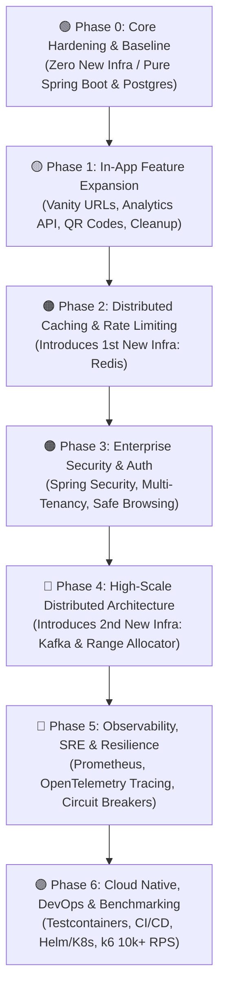

# 🗺️ Project Roadmap & Issue Templates

This document contains the complete, copy-paste ready backlog for **URL Shortener Service**. Each story is packaged with its **Title**, **Labels**, and a **Copy-Paste Issue Body** block ready for GitHub.

---

## 📌 Phased Progression Overview



---

# Phase 0: Core Hardening & Baseline Completion
> **Complexity:** 🟢 Low (In-Process / Zero External Dependencies)

---

### Story 0.1: Global Exception Handling & RFC 7807 Problem Details

* **Issue Title:** `[Core] Implement Global Exception Handler with RFC 7807 ProblemDetail`
* **Labels:** `type:feature`, `priority:high`, `layer:api`
* **Copy-Paste Description:**

```markdown
### 🎯 Objective
Implement centralized, RFC 7807-compliant global exception handling for all REST API endpoints to avoid unhandled 500 errors and information leakage.

### 📖 Context
Currently, `UrlShortenerService` throws raw `IllegalArgumentException` when a short code is not found, resulting in a generic 500 response. We need clean, structured error responses for client consumers.

### 🛠️ Proposed Tasks
- [ ] Create `@RestControllerAdvice` class `GlobalExceptionHandler`.
- [ ] Implement custom domain exceptions:
  - `UrlNotFoundException` (mapped to HTTP 404 Not Found)
  - `InvalidUrlException` (mapped to HTTP 400 Bad Request)
  - `UrlExpiredException` (mapped to HTTP 410 Gone)
- [ ] Handle `MethodArgumentNotValidException` to extract field-level validation errors.
- [ ] Catch unhandled `Exception` instances and return HTTP 500 with a sanitized message without exposing internal stack traces.
- [ ] Write unit and slice tests verifying HTTP response status codes and problem detail payloads.

### ✅ Acceptance Criteria
- [ ] Requesting a non-existent `GET /{shortCode}` returns `404 Not Found` with RFC 7807 JSON (`title`, `status`, `detail`, `timestamp`).
- [ ] Malformed payloads return `400 Bad Request` with an array of invalid fields.
- [ ] Internal errors do not leak stack traces or database schema details to clients.
```

---

### Story 0.2: Request Validation & URL Sanitization

* **Issue Title:** `[Security/Core] Add strict URL validation, protocol whitelisting, and SSRF prevention`
* **Labels:** `type:security`, `priority:high`, `layer:core`
* **Copy-Paste Description:**

```markdown
### 🎯 Objective
Validate incoming target URLs against malicious schemes, local IP addresses (SSRF prevention), and RFC specifications.

### 📖 Context
`ShortenRequest` currently accepts any arbitrary string without format or scheme verification, leaving the system vulnerable to SSRF and invalid redirect targets.

### 🛠️ Proposed Tasks
- [ ] Add `jakarta.validation:jakarta.validation-api` and `hibernate-validator` if needed.
- [ ] Create a custom `@ValidUrl` constraint annotation and `UrlValidator` implementation:
  - Whitelist only `http` and `https` protocols (reject `javascript:`, `file:`, `data:`, `ftp:`).
  - Block loopback, link-local, and RFC 1918 private IP ranges (`127.0.0.1`, `localhost`, `10.0.0.0/8`, `172.16.0.0/12`, `192.168.0.0/16`).
  - Enforce maximum URL character length (2048 characters).
- [ ] Annotate `ShortenRequest.url()` with `@NotBlank` and `@ValidUrl`.
- [ ] Add `@Valid` on `UrlController.createShortUrl()` payload parameter.

### ✅ Acceptance Criteria
- [ ] URLs with invalid schemes (e.g. `javascript:alert(1)`) are rejected with `400 Bad Request`.
- [ ] Localhost/internal network targets are blocked to prevent SSRF.
- [ ] Valid URLs (`https://example.com/page?query=1`) are accepted.
```

---

### Story 0.3: Dynamic Base URL Configuration

* **Issue Title:** `[Config] Decouple hardcoded localhost URL from controller to configuration properties`
* **Labels:** `type:chore`, `priority:medium`, `layer:api`
* **Copy-Paste Description:**

```markdown
### 🎯 Objective
Decouple the short URL base domain from hardcoded controller strings into externalized Spring configuration properties.

### 📖 Context
`UrlController` currently hardcodes `"http://localhost:9090/" + url.getShortCode()`, preventing deployment to staging, custom domains, or production environments.

### 🛠️ Proposed Tasks
- [ ] Create `@ConfigurationProperties(prefix = "app.shortener")` class `ShortenerProperties` with `baseUrl` field (default: `http://localhost:9090`).
- [ ] Support environment variable override via `APP_SHORTENER_BASE_URL`.
- [ ] Update `UrlController` to assemble short URLs using `shortenerProperties.getBaseUrl()`.
- [ ] Ensure trailing slashes are sanitized and normalized.

### ✅ Acceptance Criteria
- [ ] Short URL generation reflects the configured base URL domain.
- [ ] Setting `APP_SHORTENER_BASE_URL=https://sho.rt` produces `https://sho.rt/{shortCode}`.
```

---

### Story 0.4: URL Expiration & TTL Enforcement on Redirect

* **Issue Title:** `[Feature] Support optional expiration timestamp and enforce TTL on redirect`
* **Labels:** `type:feature`, `priority:high`, `layer:core`
* **Copy-Paste Description:**

```markdown
### 🎯 Objective
Allow clients to set optional expiration durations for short links and enforce TTL checks during redirect lookups.

### 📖 Context
The Flyway schema already contains the `expires_at` column in the `urls` table, but the application layer does not populate or check it during redirects.

### 🛠️ Proposed Tasks
- [ ] Extend `ShortenRequest` with an optional `expiresInSeconds` or `expiresAt` field.
- [ ] Calculate and persist `expires_at` in `UrlShortenerService.shortenUrl()`.
- [ ] Update `UrlShortenerService.getOriginalUrl()`:
  - Check `if (url.getExpiresAt() != null && url.getExpiresAt().isBefore(Instant.now()))`.
  - Throw `UrlExpiredException` (mapped to HTTP 410 Gone).
  - Evict expired keys from cache.
- [ ] Add unit and integration tests for expired and non-expired links.

### ✅ Acceptance Criteria
- [ ] A short link created with expiration redirects normally before expiration.
- [ ] Accessing an expired short link returns `410 Gone` and does not redirect.
```

---

### Story 0.5: Asynchronous Click Tracking Ingestion Baseline

* **Issue Title:** `[Analytics] Implement ClickEvent entity, repository, and async telemetry recorder`
* **Labels:** `type:feature`, `priority:high`, `layer:data`
* **Copy-Paste Description:**

```markdown
### 🎯 Objective
Implement non-blocking click event capture using Spring `@Async` and persist telemetry records into the existing `click_events` table.

### 📖 Context
The `click_events` table exists in Flyway V1, but there is no Java entity or service writing click telemetry. Redirect latency must remain sub-millisecond while capturing analytics.

### 🛠️ Proposed Tasks
- [ ] Create `ClickEvent` JPA entity mapped to table `click_events`.
- [ ] Create `ClickEventRepository` interface with Spring Data JPA.
- [ ] Create `AnalyticsService` with an `@Async` method `recordClick(String shortCode, String referer, String userAgent, String clientIp)`.
- [ ] Implement SHA-256 IP hashing utility with optional salt to ensure GDPR compliance.
- [ ] Extract `Referer`, `User-Agent`, and client IP (`X-Forwarded-For` fallback) in `UrlController.redirect()` and trigger async recording.
- [ ] Enable `@EnableAsync` in Spring Boot configuration with a bounded `ThreadPoolTaskExecutor`.

### ✅ Acceptance Criteria
- [ ] Each redirect inserts a record into `click_events` with hashed IP, user agent, referer, and timestamp.
- [ ] Click logging failure or latency does not block or slow down HTTP 302 redirects.
```

---

# Phase 1: In-App Feature Expansion
> **Complexity:** 🟡 Low-Medium (Core App Logic / PostgreSQL)

---

### Story 1.1: Custom Vanity Aliases & Keyword Reservation

* **Issue Title:** `[Feature] Support Custom Short Codes with Reserved Keyword Blacklist`
* **Labels:** `type:feature`, `priority:medium`, `layer:core`
* **Copy-Paste Description:**

```markdown
### 🎯 Objective
Enable users to specify custom alphanumeric short aliases (e.g. `/summer-sale-2026`) with uniqueness enforcement and reserved keyword protection.

### 📖 Context
Users need branded, readable short links instead of only auto-generated Base62 codes.

### 🛠️ Proposed Tasks
- [ ] Add optional `customAlias` field to `ShortenRequest`.
- [ ] Add validation pattern for aliases: `^[a-zA-Z0-9_-]{3,30}$`.
- [ ] Implement reserved keyword blacklist (`api`, `actuator`, `swagger`, `health`, `metrics`, `admin`, `login`, `register`, `static`).
- [ ] Update `UrlShortenerService` to handle custom aliases and catch `DataIntegrityViolationException` on unique constraint collisions.
- [ ] Return `409 Conflict` if the requested alias is already taken.

### ✅ Acceptance Criteria
- [ ] Shortening with an available custom alias returns `201 Created` with that code.
- [ ] Shortening with an existing alias returns `409 Conflict`.
- [ ] Attempting to claim reserved keywords (e.g. `/api`) returns `400 Bad Request`.
```

---

### Story 1.2: Aggregated Click Analytics API Engine

* **Issue Title:** `[Analytics] Real-Time Analytics API (Time-Series, Referrers, Devices)`
* **Labels:** `type:feature`, `priority:high`, `layer:api`
* **Copy-Paste Description:**

```markdown
### 🎯 Objective
Provide a REST endpoint to query click statistics, time-series trends, top referrers, and device breakdown for any short code.

### 📖 Context
Users who create short links need visibility into link performance and audience demographics.

### 🛠️ Proposed Tasks
- [ ] Define `AnalyticsResponse` DTO containing:
  - Total click count
  - Unique visitor count (distinct IP hashes)
  - Time-series buckets (hourly/daily click counts)
  - Top referrers list with counts
  - Device/browser breakdown (parsed from User-Agent)
- [ ] Create repository aggregation queries in `ClickEventRepository`.
- [ ] Create endpoint `GET /api/v1/urls/{shortCode}/analytics`.
- [ ] Return `404 Not Found` if the short code does not exist.

### ✅ Acceptance Criteria
- [ ] Calling `GET /api/v1/urls/{shortCode}/analytics` returns structured JSON with accurate aggregated metrics.
- [ ] Queries perform efficiently using existing `idx_click_events_analytics` index.
```

---

### Story 1.3: Scheduled Expiration Cleanup Job

* **Issue Title:** `[Data] Scheduled Background Job for Expired URL Pruning`
* **Labels:** `type:chore`, `priority:medium`, `layer:data`
* **Copy-Paste Description:**

```markdown
### 🎯 Objective
Implement an automated background cleanup task to prune expired short URLs and their associated click records from PostgreSQL.

### 📖 Context
Over time, expired URLs accumulate in the database, increasing table sizes and degrading index performance.

### 🛠️ Proposed Tasks
- [ ] Enable Spring scheduling with `@EnableScheduling`.
- [ ] Implement `UrlCleanupScheduler` running on a configurable cron schedule (e.g., daily at 2:00 AM).
- [ ] Delete expired records in non-blocking batches (e.g., 1,000 rows per batch) to avoid long table locks.
- [ ] Evict deleted short codes from cache.
- [ ] Log metrics: count of pruned URLs and duration.

### ✅ Acceptance Criteria
- [ ] Scheduled job runs automatically and purges records where `expires_at < NOW()`.
- [ ] Deletions occur in bounded batches without blocking live read/write queries.
```

---

### Story 1.4: Dynamic QR Code Generation

* **Issue Title:** `[Feature] Dynamic PNG/SVG QR Code Generation Endpoint`
* **Labels:** `type:feature`, `priority:low`, `layer:api`
* **Copy-Paste Description:**

```markdown
### 🎯 Objective
Generate scannable QR code images dynamically for any active short URL.

### 📖 Context
Users sharing links on print media, presentations, and mobile apps require instant QR code graphics.

### 🛠️ Proposed Tasks
- [ ] Add `com.google.zxing:core` and `com.google.zxing:javase` dependencies.
- [ ] Create `QrCodeService` to render PNG byte arrays from text.
- [ ] Implement endpoint `GET /{shortCode}/qr` with optional query parameters (`size`, default 250px).
- [ ] Set response `Content-Type: image/png` with `Cache-Control: public, max-age=86400`.
- [ ] Return `404 Not Found` if the short code does not exist.

### ✅ Acceptance Criteria
- [ ] `GET /{shortCode}/qr` returns a valid PNG image rendering the full destination redirect URL.
- [ ] Scanning the QR code on a mobile device opens the short link.
```

---

# Phase 2: Distributed Caching & Rate Limiting
> **Complexity:** 🟠 Medium (Introduces Redis Infrastructure)

---

### Story 2.1: Two-Tier Distributed Caching (L1 Caffeine + L2 Redis)

* **Issue Title:** `[Performance] Implement Two-Tier Caching (L1 Caffeine + L2 Redis)`
* **Labels:** `type:performance`, `priority:critical`, `layer:data`
* **Copy-Paste Description:**

```markdown
### 🎯 Objective
Implement a high-throughput two-tier caching architecture combining local L1 near-cache (Caffeine) and distributed L2 cache (Redis) with multi-node invalidation.

### 📖 Context
Currently, Caffeine is purely in-memory on a single JVM. Running multiple replicas behind a load balancer causes cache incoherency and excessive database read spikes on cache misses.

### 🛠️ Proposed Tasks
- [ ] Add `spring-boot-starter-data-redis` dependency.
- [ ] Add Redis service to `docker-compose.yml`.
- [ ] Configure Redis `CacheManager` with default TTL (e.g., 24 hours).
- [ ] Implement L1 near-cache fallback:
  - Check L1 Caffeine ➔ on miss, check L2 Redis ➔ on miss, query PostgreSQL and backfill both caches.
- [ ] Implement Redis Pub/Sub invalidation channel to evict L1 caches across all active app nodes when a URL is modified or deleted.

### ✅ Acceptance Criteria
- [ ] Cache hits on any cluster instance resolve from Redis/Caffeine without database queries.
- [ ] Node A evicting a key sends a Pub/Sub message causing Node B to invalidate its local L1 cache.
```

---

### Story 2.2: Distributed Sliding-Window Rate Limiting

* **Issue Title:** `[Security] Implement distributed sliding-window rate limiting via Redis`
* **Labels:** `type:security`, `priority:critical`, `layer:security`
* **Copy-Paste Description:**

```markdown
### 🎯 Objective
Protect public endpoints from denial-of-service (DDoS) and brute-force scraping using a distributed sliding-window rate limiter backed by Redis.

### 📖 Context
Without rate limiting, malicious clients can overwhelm redirect lookups or exhaust database sequences by spamming URL generation.

### 🛠️ Proposed Tasks
- [ ] Implement Redis sliding-window counter / token bucket using Bucket4j or atomic Redis Lua script.
- [ ] Create `RateLimitingFilter` configured per endpoint:
  - Redirect `GET /{shortCode}`: 100 requests / second per IP.
  - Shorten `POST /api/v1/urls`: 10 requests / minute per IP.
- [ ] Include standard rate limit response headers:
  - `X-RateLimit-Limit`
  - `X-RateLimit-Remaining`
  - `Retry-After` (when throttled)
- [ ] Return `429 Too Many Requests` when limit is exceeded.

### ✅ Acceptance Criteria
- [ ] Requests exceeding threshold are rejected with HTTP 429 before reaching controllers.
- [ ] Rate limits work consistently across multiple application replicas sharing the Redis instance.
```

---

# Phase 3: Enterprise Security & Access Control
> **Complexity:** 🟠 Medium-High (Spring Security, Multi-Tenancy & Threat Protection)

---

### Story 3.1: Multi-Tenant API Key Authentication

* **Issue Title:** `[Security] Multi-Tenant API Key Authentication with Spring Security`
* **Labels:** `type:security`, `priority:high`, `layer:security`
* **Copy-Paste Description:**

```markdown
### 🎯 Objective
Implement multi-tenant API key authentication to secure management/analytics endpoints and enforce tiered rate limits.

### 📖 Context
Enterprise usage requires identifying clients, tracking quotas per tenant, and preventing unauthorized access to analytics data.

### 🛠️ Proposed Tasks
- [ ] Add `spring-boot-starter-security`.
- [ ] Create `api_keys` table (`id`, `tenant_id`, `key_hash`, `tier`, `is_active`, `created_at`).
- [ ] Implement `ApiKeyAuthenticationFilter` extracting and verifying the `X-API-Key` header.
- [ ] Store API keys as SHA-256 hashes (never plaintext).
- [ ] Associate shortened URLs and analytics access with authenticated `tenant_id`.
- [ ] Expose public redirect `GET /{shortCode}` without authentication while requiring auth for management APIs.

### ✅ Acceptance Criteria
- [ ] Calls to `/api/v1/urls` with a valid `X-API-Key` authenticate successfully.
- [ ] Missing or invalid API keys return `401 Unauthorized`.
- [ ] Tenants can only view analytics for URLs created under their `tenant_id`.
```

---

### Story 3.2: Malicious URL & Phishing Scanner

* **Issue Title:** `[Security] Phishing & Malicious URL detection via Google Safe Browsing API`
* **Labels:** `type:security`, `priority:medium`, `layer:core`
* **Copy-Paste Description:**

```markdown
### 🎯 Objective
Prevent URL Shortener Service from being used as a vector for malware distribution and phishing by scanning target URLs against threat feeds.

### 📖 Context
URL shorteners are frequent targets for spammers hiding malicious destination URLs.

### 🛠️ Proposed Tasks
- [ ] Create `SafeBrowsingClient` with configurable API key and timeout.
- [ ] Implement destination URL verification against Google Safe Browsing Lookup API (or threat intelligence feed).
- [ ] Add circuit breaker to ensure external API downtime does not block creation when configured to fail-open.
- [ ] Reject detected malware/phishing links with `422 Unprocessable Entity`.

### ✅ Acceptance Criteria
- [ ] Submitting a known malware/phishing test domain (e.g. `testsafebrowsing.appspot.com`) is blocked with HTTP 422.
- [ ] Safe URLs proceed normally through creation.
```

---

### Story 3.3: OWASP Security Hardening & Actuator Isolation

* **Issue Title:** `[Security] Enforce OWASP security headers, CORS policies, and separate Actuator port`
* **Labels:** `type:security`, `priority:medium`, `layer:security`
* **Copy-Paste Description:**

```markdown
### 🎯 Objective
Harden HTTP response headers, configure strict CORS rules, and isolate Spring Boot Actuator management endpoints from public ingress.

### 📖 Context
Actuator endpoints (`/actuator/env`, `/actuator/beans`, `/actuator/metrics`) must never be exposed to public Internet traffic.

### 🛠️ Proposed Tasks
- [ ] Configure OWASP security headers in `SecurityFilterChain`:
  - `X-Content-Type-Options: nosniff`
  - `X-Frame-Options: DENY`
  - `Content-Security-Policy: default-src 'self'`
  - `Strict-Transport-Security: max-age=31536000; includeSubDomains`
- [ ] Configure explicit CORS whitelist for management APIs.
- [ ] Move management port to `9091` (`management.server.port=9091`) in `application.yaml`.

### ✅ Acceptance Criteria
- [ ] Public traffic on port 9090 cannot reach `/actuator` endpoints.
- [ ] All HTTP responses contain standard OWASP security headers.
```

---

# Phase 4: High-Scale Distributed Architecture
> **Complexity:** 🔴 High (Distributed ID Generation & Event Streaming Broker)

---

### Story 4.1: Distributed Range-Based ID Allocator

* **Issue Title:** `[Architecture] Replace single PostgreSQL sequence with distributed Range-Based ID Allocator`
* **Labels:** `type:performance`, `priority:critical`, `layer:core`
* **Copy-Paste Description:**

```markdown
### 🎯 Objective
Eliminate single database sequence bottlenecks by implementing a distributed Range-Based Token/ID Allocator.

### 📖 Context
Currently, each `shortenUrl()` query calls `nextval('url_id_seq')` directly on PostgreSQL, limiting throughput under high concurrent write load.

### 🛠️ Proposed Tasks
- [ ] Create `id_ranges` table in PostgreSQL / Redis token coordinator.
- [ ] Implement `RangeIdAllocatorService`:
  - Instances atomically lease a block of IDs (e.g., 10,000 IDs per lease).
  - In-memory `AtomicLong` dispenses IDs locally without network roundtrips.
  - Request a new range asynchronously when the current range is 80% exhausted.
- [ ] Handle node crash and restart cleanly without ID collisions.
- [ ] Benchmarking: demonstrate 100x reduction in database sequence queries.

### ✅ Acceptance Criteria
- [ ] Application nodes dispense unique Base62 IDs locally.
- [ ] Under a load of 10,000 creations, PostgreSQL is contacted only once for ID leasing.
```

---

### Story 4.2: Asynchronous Click Telemetry via Kafka / RabbitMQ

* **Issue Title:** `[Architecture] Decouple Click Telemetry via Message Broker (Kafka / RabbitMQ)`
* **Labels:** `type:performance`, `priority:high`, `layer:infra`
* **Copy-Paste Description:**

```markdown
### 🎯 Objective
Decouple click event logging from in-process thread pools into a distributed message broker to guarantee zero event loss and handle traffic surges.

### 📖 Context
In-memory `@Async` drops events during abrupt JVM shutdowns or database connection pool exhaustion.

### 🛠️ Proposed Tasks
- [ ] Add `spring-kafka` (or `spring-rabbit`) dependency and add broker service to `docker-compose.yml`.
- [ ] Publish click events asynchronously to `url-clicks` topic upon redirect.
- [ ] Create a separate consumer component that consumes click batches (e.g., 500 events per batch) and performs bulk inserts (`saveAll`) into PostgreSQL.
- [ ] Implement dead-letter topic (DLQ) for unparseable or corrupted telemetry events.

### ✅ Acceptance Criteria
- [ ] Click events are safely published to Kafka topic in < 2ms.
- [ ] Batch consumer flushes records into PostgreSQL efficiently.
- [ ] Service restarts during high traffic cause zero dropped telemetry events.
```

---

### Story 4.3: Database Partitioning for Analytics Tables

* **Issue Title:** `[Data] Partition Click Events Table by Range / Time`
* **Labels:** `type:performance`, `priority:medium`, `layer:data`
* **Copy-Paste Description:**

```markdown
### 🎯 Objective
Implement time-based table partitioning for `click_events` in PostgreSQL to sustain fast query performance as analytics records grow to tens of millions.

### 📖 Context
Unpartitioned append-only analytics tables cause sequential scan degradation, bloated indexes, and expensive maintenance operations.

### 🛠️ Proposed Tasks
- [ ] Write Flyway migration `V2__partition_click_events.sql`:
  - Convert `click_events` to a partitioned table (`PARTITION BY RANGE (clicked_at)`).
  - Create monthly partition tables for current and future months.
- [ ] Update indexes on partitioned tables.
- [ ] Test analytics queries to verify PostgreSQL executes partition pruning.

### ✅ Acceptance Criteria
- [ ] `click_events` inserts and queries route automatically to the appropriate monthly partition.
- [ ] Old partitions can be archived or dropped with `DROP TABLE` without full table locks.
```

---

# Phase 5: Production Observability, SRE & Resilience
> **Complexity:** 🔴 High (Distributed Tracing, Metrics, Circuit Breakers & Fallbacks)

---

### Story 5.1: Custom Business & Performance Metrics (Micrometer & Prometheus)

* **Issue Title:** `[Observability] Instrument Custom Business & System Metrics with Micrometer`
* **Labels:** `type:observability`, `priority:high`, `layer:observability`
* **Copy-Paste Description:**

```markdown
### 🎯 Objective
Instrument comprehensive custom business metrics, redirect latency percentiles, and cache hit ratios exposed via Prometheus.

### 📖 Context
Production SRE requires real-time monitoring of redirect latency SLIs, error rates, and cache performance.

### 🛠️ Proposed Tasks
- [ ] Add `micrometer-registry-prometheus` dependency.
- [ ] Register custom meters:
  - `Timer`: `url.redirect.latency` (tagged with `cache_hit=true|false`)
  - `Counter`: `url.shorten.requests` (tagged with `status`, `tenant`)
  - `Counter`: `url.expired.access`
  - `Gauge`: `cache.l1.size`, `cache.l2.hit_ratio`
  - `Gauge`: `id_allocator.remaining_range`
- [ ] Configure Prometheus endpoint on management port `9091`.
- [ ] Provide sample Grafana dashboard JSON template in `grafana/dashboard.json`.

### ✅ Acceptance Criteria
- [ ] `/actuator/prometheus` exposes custom metrics with latency histograms (p50, p95, p99).
```

---

### Story 5.2: Distributed Tracing with OpenTelemetry

* **Issue Title:** `[Observability] Add OpenTelemetry Distributed Tracing & W3C TraceContext propagation`
* **Labels:** `type:observability`, `priority:medium`, `layer:observability`
* **Copy-Paste Description:**

```markdown
### 🎯 Objective
Implement distributed tracing across HTTP requests, database queries, and Kafka event pipelines using OpenTelemetry and Micrometer Tracing.

### 📖 Context
Debugging latency bottlenecks across multi-tier caches, databases, and message brokers requires unified end-to-end trace correlation.

### 🛠️ Proposed Tasks
- [ ] Add `io.micrometer:micrometer-tracing-bridge-otel` and OpenTelemetry exporter.
- [ ] Propagate W3C `traceparent` headers across HTTP requests and Kafka record headers.
- [ ] Add trace correlation to async consumers and scheduled tasks.
- [ ] Configure sampling rate (default 100% in dev, 10% in prod).

### ✅ Acceptance Criteria
- [ ] Traces for incoming redirect requests correlate with background Kafka click processing.
- [ ] Traces export cleanly to Jaeger / Zipkin / OpenTelemetry Collector.
```

---

### Story 5.3: Structured JSON Logging with Trace Correlation

* **Issue Title:** `[Observability] Configure Logback JSON Layout with MDC Trace Correlation`
* **Labels:** `type:observability`, `priority:medium`, `layer:observability`
* **Copy-Paste Description:**

```markdown
### 🎯 Objective
Configure structured JSON logging with MDC trace/span correlation for seamless ingestion into log aggregators (ELK, Loki, Datadog).

### 📖 Context
Standard text logs require fragile regex parsers and lack automated trace correlation in log management tools.

### 🛠️ Proposed Tasks
- [ ] Add `net.logstash.logback:logstash-logback-encoder` dependency.
- [ ] Create `logback-spring.xml` configuring JSON layout for console output in production profile.
- [ ] Include standard fields: `@timestamp`, `level`, `service.name`, `thread`, `logger`, `traceId`, `spanId`, `message`.

### ✅ Acceptance Criteria
- [ ] Application stdout produces valid single-line JSON logs.
- [ ] `traceId` and `spanId` are automatically populated in log entries during request handling.
```

---

### Story 5.4: Resilience4j Circuit Breakers & Graceful Degradation

* **Issue Title:** `[SRE] Resilience4j Circuit Breakers and Fallbacks for Redis, Kafka, and Database`
* **Labels:** `type:performance`, `priority:high`, `layer:core`
* **Copy-Paste Description:**

```markdown
### 🎯 Objective
Implement circuit breakers, retry policies, and graceful fallbacks for Redis and Kafka dependencies to ensure 99.99% redirect availability.

### 📖 Context
Redirects must never fail even if secondary systems (Redis cache or Kafka broker) experience outages.

### 🛠️ Proposed Tasks
- [ ] Add `io.github.resilience4j:resilience4j-spring-boot3`.
- [ ] Configure Circuit Breaker on Redis cache lookup:
  - If Redis fails ➔ Circuit opens ➔ Fallback directly to PostgreSQL query without throwing 500.
- [ ] Configure Circuit Breaker on Kafka event producer:
  - If Kafka is down ➔ Circuit opens ➔ Spool click events to local ring buffer or disk log.
- [ ] Expose circuit breaker health metrics via Actuator.

### ✅ Acceptance Criteria
- [ ] Shutting down Redis does not cause HTTP 302 redirect failures.
- [ ] Shutting down Kafka broker does not fail user redirect requests.
```

---

# Phase 6: Cloud Native, DevOps & Benchmarking
> **Complexity:** 🟣 Advanced (Full CI/CD, Container Optimization, Helm/K8s & 10,000+ RPS Stress Tests)

---

### Story 6.1: Testcontainers Integration Test Suite

* **Issue Title:** `[Testing] Comprehensive Integration Test Suite with Testcontainers`
* **Labels:** `type:infra`, `priority:high`, `layer:devops`
* **Copy-Paste Description:**

```markdown
### 🎯 Objective
Build an automated integration test suite utilizing Testcontainers for real PostgreSQL, Redis, and Kafka test execution.

### 📖 Context
Mock tests fail to catch subtle race conditions, query syntax errors, and distributed cache invalidation bugs.

### 🛠️ Proposed Tasks
- [ ] Add `org.testcontainers:postgresql`, `org.testcontainers:kafka`, and generic Redis container dependencies.
- [ ] Create reusable base integration test class (`AbstractIntegrationTest`) managing container lifecycles.
- [ ] Write integration test scenarios:
  - End-to-end URL shortening ➔ Cache hit ➔ Redirect ➔ Async Click Persistence.
  - Multi-threaded concurrent shortening to verify zero ID collisions.
  - Rate limiting exhaustion and recovery.
  - Expired link lookup returning 410 Gone.

### ✅ Acceptance Criteria
- [ ] `./mvnw verify` runs complete integration test suite with zero pre-installed external services.
```

---

### Story 6.2: GitHub Actions CI Pipeline & Security Scanning

* **Issue Title:** `[DevOps] GitHub Actions CI Pipeline with CodeQL SAST and Docker Build`
* **Labels:** `type:infra`, `priority:high`, `layer:devops`
* **Copy-Paste Description:**

```markdown
### 🎯 Objective
Set up automated GitHub Actions workflow for pull request validation, unit/integration testing, security scanning, and container packaging.

### 📖 Context
Continuous Integration ensures every PR meets code quality, test coverage, and security standards before merge.

### 🛠️ Proposed Tasks
- [ ] Create `.github/workflows/ci.yml`:
  - Trigger on push and pull requests to `main`.
  - Matrix test on Java 17 and 21.
  - Run `./mvnw clean verify` with JaCoCo code coverage report.
  - Run GitHub CodeQL static application security testing (SAST).
  - Build Docker container image.
- [ ] Configure branch protection rules requiring CI checks to pass before merge.

### ✅ Acceptance Criteria
- [ ] Pull requests automatically trigger CI workflow and display pass/fail status checks.
```

---

### Story 6.3: Production Multi-Stage Distroless Dockerfile

* **Issue Title:** `[DevOps] Optimized Multi-Stage Dockerfile with Distroless JRE`
* **Labels:** `type:infra`, `priority:medium`, `layer:devops`
* **Copy-Paste Description:**

```markdown
### 🎯 Objective
Create a secure, minimal multi-stage Dockerfile leveraging Spring Boot layered JARs and Google Distroless runtime.

### 📖 Context
Standard fat JAR images are heavy (>400MB) and contain unnecessary package managers/shells that increase the security vulnerability attack surface.

### 🛠️ Proposed Tasks
- [ ] Create `Dockerfile` with multi-stage build:
  - Stage 1: Maven build and Spring Boot layer extraction (`java -Djarmode=layertools -jar app.jar extract`).
  - Stage 2: Runtime image using `gcr.io/distroless/java17-debian12:nonroot`.
- [ ] Run container as non-root user.
- [ ] Configure JVM memory flags (`-XX:+UseG1GC`, `-XX:MaxRAMPercentage=75.0`).

### ✅ Acceptance Criteria
- [ ] Image builds cleanly with size under 200MB.
- [ ] Container vulnerability scan (Trivy / Snyk) reports zero critical CVEs.
```

---

### Story 6.4: Helm Chart & Kubernetes Manifests

* **Issue Title:** `[DevOps] Helm Chart and Kubernetes Manifests with HPA and Probes`
* **Labels:** `type:infra`, `priority:medium`, `layer:devops`
* **Copy-Paste Description:**

```markdown
### 🎯 Objective
Author production-ready Helm chart and Kubernetes manifests with autoscaling, probes, and high-availability configuration.

### 📖 Context
Deploying to cloud Kubernetes clusters (EKS, GKE, AKS) requires declarative manifests for rolling upgrades and auto-recovery.

### 🛠️ Proposed Tasks
- [ ] Create `helm/url-shortener/` chart containing:
  - `deployment.yaml` with Liveness (`/actuator/health/liveness`) and Readiness (`/actuator/health/readiness`) probes.
  - `service.yaml` and `ingress.yaml`.
  - `configmap.yaml` and `secret.yaml`.
  - `hpa.yaml` (Horizontal Pod Autoscaler scaling on CPU > 70% or request rate).
  - `pdb.yaml` (Pod Disruption Budget for high availability).
- [ ] Validate chart with `helm lint` and `helm template`.

### ✅ Acceptance Criteria
- [ ] Service deploys cleanly to Kubernetes with zero-downtime rolling updates.
```

---

### Story 6.5: k6 High-Concurrency Load Testing Suite

* **Issue Title:** `[Testing] k6 Performance Benchmark Suite for 10,000+ RPS Validation`
* **Labels:** `type:performance`, `priority:medium`, `layer:devops`
* **Copy-Paste Description:**

```markdown
### 🎯 Objective
Develop an automated k6 load testing suite to benchmark redirect and creation throughput against enterprise performance targets.

### 📖 Context
We need empirical proof that the service sustains 10,000+ RPS with sub-10ms p99 latency under simulated high-traffic conditions.

### 🛠️ Proposed Tasks
- [ ] Create `load-tests/` directory with k6 benchmark scripts:
  - `redirect-benchmark.js`: 95% read traffic at 15,000 RPS.
  - `shorten-spike.js`: 5,000 RPS concurrent write burst.
  - `rate-limit-stress.js`: Verifies 429 throttling under attack load.
- [ ] Configure automated HTML summary reporting.
- [ ] Document benchmark instructions in `load-tests/README.md`.

### ✅ Acceptance Criteria
- [ ] Redirect benchmark validates p99 latency < 10ms at 10,000+ RPS.
- [ ] Write spike executes without sequence deadlocks or database connection starvation.
```
